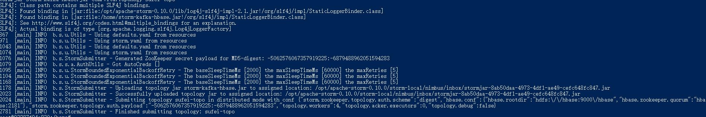

# kafka & storm & hbase & docker(Wordcount DEMO）

-----

> kafka作为分布式消息系统，实时大吞吐量消息系统;
> storm作为大数据的实时处理系统;
> hbase是apache hadoop 的数据库，其具有高效的读写性能,而且针对分布式设计
> docker 目前非常火的,高可用应用容器引擎

#### 一、说明
基于docker的容器集群,管理hadoop集群,把kafka的生产者,将字符串pull到storm的KafkaSpout,然后转发各种Bolt,到最后Hbase保存信息到'wordcout'表里面.
docker的github地址: , 具体使用说明请看README

#### 二、操作准备流程

假设已经启动容器集群

##### 1. hbase 建表

> 在hbase中建立相应的表：
> hbase(main):060:0> create 'wordcount','result'

##### 2. kafka 创建Topic

在kafka中建立相应的topic：

> [hadoop@kafka vita]$ bin/kafka-topics.sh --create --zookeeper zk:2181 --replication-factor 1 --partitions 1 --topic test

> Created topic "test".

##### 3.打包Artifacts(IntelliJ IDEA)

>具体怎么build,问度娘就可以了. 这里注意一下,build的jar ,去掉storm-core.jar,所有log4j.jar,slf4j.jar,因为storm环境已经存在这些jar,不然会包冲突

##### 4. kafka生产端发送数据

在kafka生产者端输入数据：

> [hadoop@kafka vita]$ bin/kafka-console-producer.sh --broker-list h40:9092,h41:9092,h42:9092 --topic hehe

hello world
hello world

##### 5. storm 提交Topopogy

提交Topohogy的jar,到storm执行流

> [hadoop@storm vita]$ storm jar storm-kafka-hbase.jar com.vita.Topohogy test

执行成功如下图:

 
    
    

##### 6. hbase scan 

查看hbase中的表:

> hbase(main):061:0> scan 'wordcount'
>   ROW                                                          COLUMN+CELL                                                                                                                                                                     
>   hello                                                       column=result:count, timestamp=1495132057639, value=\x00\x00\x00\x03                                                                                                            
>   world                                                       column=result:count, timestamp=1495132057642, value=\x00\x00\x00\x01            
 
-----

#### 三、注意
 
##### 1.docker compose 的ymal，要设定好extra_host, 这里就是/etc/hosts主机列表

>     extra_hosts:
>       - "nimbus:10.17.0.8"
>       - "supervisor:10.17.0.9"
>       - "hadoop:10.17.0.3"
>       - "pig:10.17.0.4"
>       - "zk:10.17.0.2"

##### 2.docker 构建后, 出现.sh not found

这里是因为sh的format是dos, 用vim,修改 set ff=unix,然后重新构建image即可

#### 3.hbase的hbase-site.xml配置问题

>      <property>
>      	<name>hbase.rootdir</name>
>      	<value>hdfs://10.17.0.3:9000/hbase</value>
>      </property>

value要是 hadoop的namenode地址,不然启动不了

#### 四、参考文章
    
    - [kafka+storm+hbase整合试验](https://blog.csdn.net/m0_37739193/article/details/72540800)
